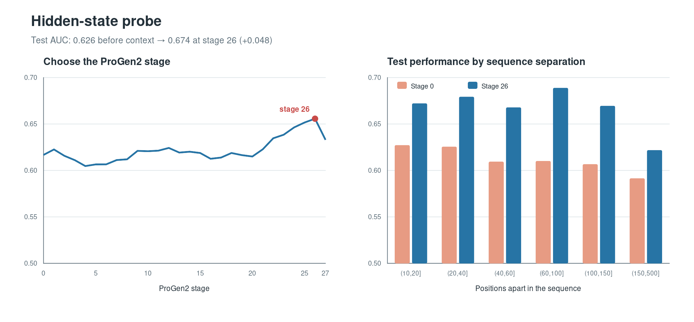

# ProGen2 Structure Probe

This repository contains a best-effort reproduction of Experiment 1 from Mandrake
Bio's [“Protein Language Models: Fluent, but clueless”](https://research.mandrake.bio/p/protein-language-models-fluent-but),
followed by one small experiment on ProGen2's hidden states.

Both experiments use the same **150-protein dataset** built from public structures
in the [RCSB Protein Data Bank](https://www.rcsb.org/).

## Approach

**1. Reproduce the attention experiment.** We tested whether ProGen2-base and
ESM-2 35M give higher attention-derived scores to residue pairs that contact in 3D
than to non-contacting pairs at the same sequence separation.

**2. Probe the hidden states.** We kept ProGen2 fixed and trained a small logistic
classifier to distinguish contacts using the model's internal residue
representations. The 150 proteins were divided into 90 for training, 30 for choosing
the layer and classifier setting, and 30 for the final test. We compared the selected
layer with Stage 0—the amino-acid embedding before ProGen2 processes any context.

## Dataset

The blog describes 150 non-redundant protein structures, 100–500 amino acids long,
determined using X-ray diffraction at resolution ≤ 2.0 Å. Since the original protein
list was not available, we constructed a replacement 150-protein dataset from RCSB
PDB. Each example is one protein chain from a PDB structure.

We selected proteins that:

- were 100–500 amino acids long;
- were determined using X-ray diffraction at resolution ≤ 2.0 Å;
- had the N, Cα, and C atom coordinates required for at least 95% of residues; and
- were distributed evenly across four protein-length ranges.

To reduce repetition, proteins were grouped when an alignment covered at least 80%
of both sequences and had at least 30% sequence identity. We selected the
best-resolution structure from each group, breaking ties by coordinate coverage and
then PDB identifier.

The exact dataset is in
[`data/manifests/experiment1_150.csv`](data/manifests/experiment1_150.csv).

## Reproduction assumptions

The post does not specify every implementation detail, so we made the following
choices. These are our assumptions, not claims about the original analysis.

| Detail | Choice used here |
|---|---|
| Protein dataset | The public 150-protein RCSB replacement set described above |
| ProGen2 model | Official `progen2-base` checkpoint |
| ESM-2 model | Official 12-layer `esm2_t12_35M_UR50D` checkpoint |
| Contact | Virtual Cβ distance below 8 Å; residues more than 10 positions apart |
| Non-contact comparison | One noncontact at exactly the same sequence separation as each selected contact |
| Attention processing | Symmetrize, apply APC and z-scoring, then take the maximum across layers and heads |
| Distance ranges | `(10,20]`, `(20,40]`, `(40,60]`, `(60,100]`, `(100,150]`, `(150,500]` |
| Random seed | `20260822` |

This produced 88,473 contact/non-contact comparisons, compared with 38,286 in the
blog. We retained all valid comparisons rather than adjusting the count to match a
different protein dataset. The full protocol is documented in
[`docs/methodology.md`](docs/methodology.md).

## Results

### Experiment 1: attention

| Pooled ROC-AUC | Blog | Our result |
|---|---:|---:|
| ProGen2 | 0.527 | 0.537 |
| ESM-2 | 0.611 | 0.615 |

An AUC of 0.5 is random ranking. Like the blog, we found that ProGen2's attention
signal was weak, while ESM-2 separated contacts more clearly.

### Follow-up: hidden states

| Final test result | Mean AUC across 30 test proteins |
|---|---:|
| Stage 0: amino-acid embedding | 0.626 |
| Stage 26: contextual representation | 0.674 |
| Improvement | **+0.048** (95% CI: **+0.033 to +0.062**) |



The result shows that contact information was easier for the classifier to recover
after ProGen2 processed the sequence. It does not show that ProGen2 can predict a
complete 3D structure.

More results are in [`docs/experiment_log.md`](docs/experiment_log.md).

## Compute

The model runs and hidden-state extraction were performed on a RunPod Secure Cloud
pod with one NVIDIA RTX 4090 GPU (24 GB VRAM). The recorded environment used Python
3.8, PyTorch 2.0.1, and CUDA 11.8. The hidden-state classifier was fitted on CPU.

## Reproduce

```bash
python3 -m venv .venv
source .venv/bin/activate
python3 -m pip install -e '.[probe,test]'
python3 -m pytest
progen2-probe fetch-structures data/manifests/experiment1_150.csv
```

Experiment settings are in [`configs/`](configs/), compact results are in
[`artifacts/`](artifacts/), and the complete RunPod commands are in
[`docs/runpod.md`](docs/runpod.md).
